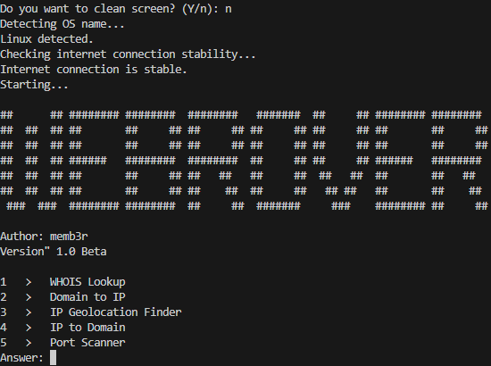

# Webrover
<p>
    
</p>



# About

Webrover - is an OSINT-tool for looking information about IPs, hosts, websites. You can scan ports, search domains by IP, search IP by domain, find IPs geolocation, make WHOIS lookup.

The goal of this project is a simple and minimalistic tool that requires as little effort as possible to install.

# How to install?

For Debian-based (apt):
```bash
# Installing python3, pip and git.
$ sudo apt install python3 python3-pip git

# Downloading Webrover using git.
$ git clone https://github.com/memb3r/Webrover
```

For Arch-based (pacman):
```bash
# Installing python3, pip and git.
$ sudo pacman -S python python-pip git

# Downloading Webrover using git.
$ git clone https://github.com/memb3r/Webrover
```

For Fedora-based (dnf):
```bash
# Installing python3, pip and git.
$ sudo dnf install python3 python3-pip git

# Downloading Webrover using git.
$ git clone https://github.com/memb3r/Webrover
```

For OpenSUSE-based (zypper):
```bash
# Installing python3, pip and git.
$ sudo zypper install python3 python3-pip git

# Downloading Webrover using git.
$ git clone https://github.com/memb3r/Webrover
```

For Void-based (xbps):
```bash
# Installing python3, pip and git.
$ sudo xbps-install -S python3 py3-pip git

# Downloading Webrover using git.
$ git clone https://github.com/memb3r/Webrover
```

For Alpine-based (apk):
```bash
# Installing python3, pip and git.
$ sudo apk add python3 py3-pip git

# Downloading Webrover using git.
$ git clone https://github.com/memb3r/Webrover
```

# Usage

To start Webrover you only need to things:
```bash
# Moving to Webrover directory.
cd Webrover

# Starting Webrover script.
python3 webrover.py
```

In 1.0, Webrover has only 5 options:
```bash
1   >   WHOIS Lookup
2   >   Domain to IP
3   >   IP Geolocation Finder
4   >   IP to Domain
5   >   Port Scanner
```

You need to input your option number inside the program to use it.

# Logs

<b>1.0:</b>

* Added WHOIS lookup
* Added Domain to IP
* IP Geolocation Finder
* IP to Domain
* Port Scanner

# FAQ

* <b>Can I test Webrover online?</b> - Yes, you can, but only on Replit, Codedamn or on other online IDEs.
* <b>Is it legal?</b> - Yes, totally legal. Webrover using OSINT (Open Source Intelligence), that is legal, because it finds information from Open Sources.
* <b>Can I install it on Windows?</b> - No. Sorry, but I don't make programs for Windows. Only Linux.
* <b>Do I need to install libraries for Webrover?</b> - No, Webrover automaticly installs libraries, but if you can't install it inside Webrover, install 'python-whois' and 'requests' libraries by yourself.
